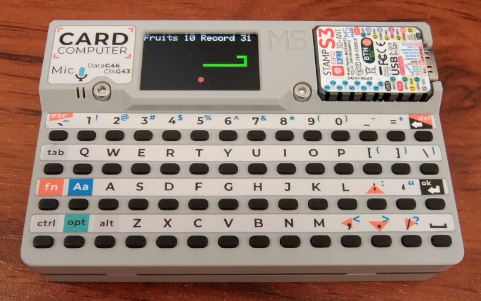

# game-snake-m5cardputer

An evolved version of game-snake-m5cardputer [game-snake-m5cardputer](https://github.com/ZrutrA/game-snake-m5cardputer) from ZrutrA

## Device information

<https://docs.m5stack.com/en/core/Cardputer>

## Appearance of the device running the Snake game

## Game controls

left: "," or left arrow

right: "/" or right arrow

up: ";" or up arrow

down: "." or down arrow

pause - "p"

new game - "n"

## Best score (record)

If an SD memory card is inserted in the device, the largest number of fruit eaten by the snake is stored on this memory. The record will still be visible after the power is restarted. If there is no SD card in the device - the record is reset after each power restart.

## How to install a game from a .bin file?

### Via ESPHome

Open <https://web.esphome.io/> in a browser that supports WebSerial (Google Chrome or Microsoft Edge). Click "Connect", select the appropriate port, click "Connect". Then click "Install", point to the snake-M5Cardputer.bin file and click "Install". Ready.

### Via M5Burner

Just find this project in the list, hit "Download" Button and then "Burn" when ready (don't forget to connect to device and select the device COM port).
